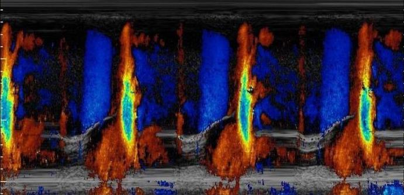

<h1> Contact the Arnaout Lab </h1>

  <h1> Graduate Programs </h1>
  The Arnaout Lab participates in the following UCSF graduate programs:
  <a href="http://biophysics.ucsf.edu/"> BioPhysics</a>
   
   
  <h1> Postdoctoral Fellows </h1>
  Inquiries about Postdoctoral positions should be emailed directly to Dr. Arnaout  and clearly, but briefly, articulate why you are potentially interested in joining the lab. Candidates will be encouraged to explore applying for extramural fellowships to support their research.
  

 

  
  
  

  <h1> Contact </h1>
  <strong>Rima Arnaout</strong>, Assistant Professor 
  
  
   
  Division of Cardiology, Department of Medicine  
  University of California, San Francisco  
  email: rima.arnaout (at) ucsf.edu     
  <i>555 Mission Bay Blvd South Rm 484</i>  
  <i>San Francisco, CA 94158</i>
  

   

